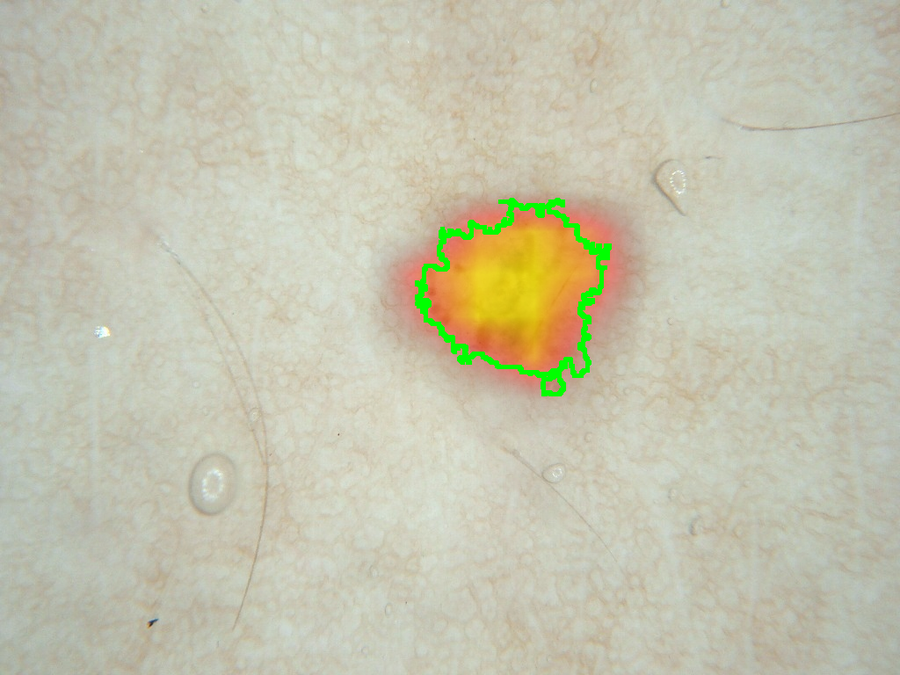
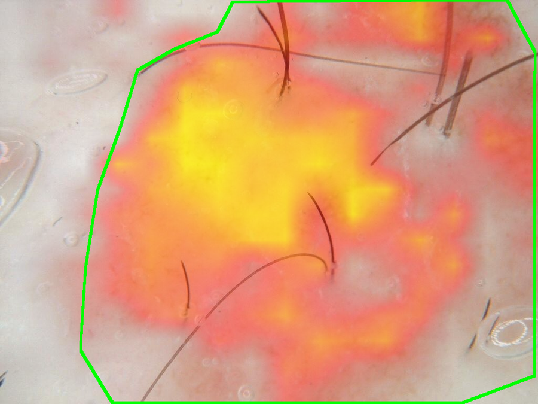
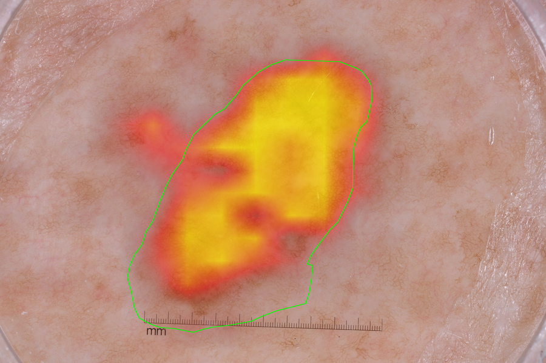

# I-JEPA Skin Lesion Segmentation

Locating skin lesions in dermoscopy images by training a linear probe on top of frozen I-JEPA features.

## What is I-JEPA?

I-JEPA (Image Joint-Embedding Predictive Architecture) is a self-supervised vision model. During pretraining it takes an image, hides most of it, and predicts the missing portion in latent space. This method allows it to learn the semantic structure of the image.

It was trained on ImageNet with no labels at all. Here it is used frozen, purely as a feature extractor.

## Approach

This project tests a simple question — do I-JEPA's features already encode *where* a lesion is, without any medical training?

The encoder (ViT-H/14) splits each 224×224 image into a 16×16 grid of patches and produces one 1280-dim vector per patch, so each image becomes a `(256, 1280)` array. The ground-truth mask is downsampled the same way, giving one lesion-coverage fraction per patch. Then a single `nn.Linear(1280, 1)` layer is trained to map a patch embedding to that fraction.

A linear probe is deliberately the weakest possible head. If one linear layer can separate lesion patches from skin patches, the useful information was already in the frozen features.

## Pipeline

```bash
python embed.py    # images -> frozen embeddings (N, 256, 1280), saved once
python train.py    # trains the linear head on those embeddings
python predict.py  # writes heatmap overlays for held-out validation images
```

Embeddings are computed once and reused, so training the head takes seconds rather than GPU-hours.

## Results

Held-out validation images (never seen during training). Red/yellow is the model's predicted lesion probability; the green outline is the ground-truth boundary.

<p align="center">
  
  
  
</p>

## Data

ISIC 2018 Challenge, Task 1 (lesion segmentation): 2,594 dermoscopy images with expert-annotated masks. Released under CC0. Not included in this repo — download from [challenge.isic-archive.com](https://challenge.isic-archive.com/data/) and place under `data/isic2018_task1/`.

The dataset requires citing both of the following:

> Codella, N., Rotemberg, V., Tschandl, P., Celebi, M.E., Dusza, S., Gutman, D., Helba, B., Kalloo, A., Liopyris, K., Marchetti, M., Kittler, H., Halpern, A. "Skin Lesion Analysis Toward Melanoma Detection 2018: A Challenge Hosted by the International Skin Imaging Collaboration (ISIC)". arXiv:1902.03368 (2018).

> Tschandl, P., Rosendahl, C., Kittler, H. "The HAM10000 dataset, a large collection of multi-source dermatoscopic images of common pigmented skin lesions". *Scientific Data* 5, 180161 (2018). doi:10.1038/sdata.2018.161

Model:

> Assran, M., Duval, Q., Misra, I., Bojanowski, P., Vincent, P., Rabbat, M., LeCun, Y., Ballas, N. "Self-Supervised Learning from Images with a Joint-Embedding Predictive Architecture". CVPR (2023). arXiv:2301.08243

## Note

Research demonstration only. Not a diagnostic tool.
